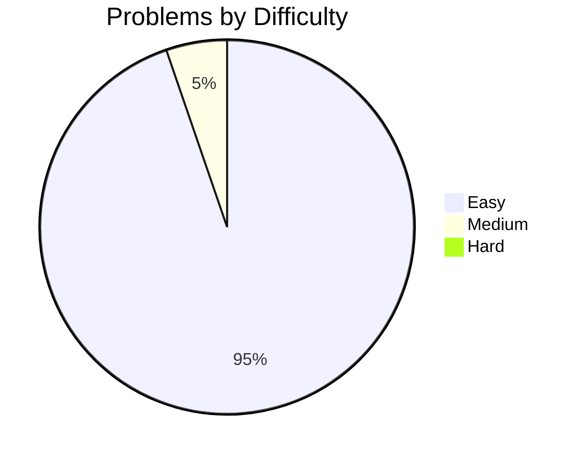

# LeetCode Practice Tracking Repository

## 📊 Quick Statistics

- **Total Problems Solved**: 19
- **Easy**: 18 | **Medium**: 1 | **Hard**: 0
- **Last Updated**: 2025-09-11

## 🔍 Quick Search Index

### By Algorithm Type
- [Array](#array-problems)
- [String](#string-problems)
- [Linked List](#linked-list-problems)
- [Stack & Queue](#stack--queue-problems)
- [Tree](#tree-problems)
- [Graph](#graph-problems)
- [Math](#math-problems)
- [Design](#design-problems)
- [Dynamic Programming](#dynamic-programming-problems)
- [Binary Search](#binary-search-problems)
- [Two Pointers](#two-pointers-problems)
- [Sliding Window](#sliding-window-problems)
- [Backtracking](#backtracking-problems)
- [Greedy](#greedy-problems)
- [Sorting](#sorting-problems)
- [Hash Table](#hash-table-problems)

### By Difficulty
- [Easy Problems](#easy-problems)
- [Medium Problems](#medium-problems)
- [Hard Problems](#hard-problems)

### By Data Structure
- [Array](#array-based-problems)
- [String](#string-based-problems)
- [Linked List](#linked-list-based-problems)
- [Binary Tree](#binary-tree-based-problems)
- [Graph](#graph-based-problems)
- [Hash Map/Set](#hash-mapset-based-problems)

---

## 📋 Complete Problems Table

| # | Problem | Difficulty | Algorithm | Data Structure | Real-world Scenario | Status | Date |
|---|---------|------------|-----------|----------------|-------------------|---------|------|
| 1995 | [Count Special Quadruplets](./problems/1995-count-special-quadruplets.md) | Easy | Hash Table, Enumeration | Array, Hash Table | Counting combinations for a target sum. | 🤔 | 2025-09-11 |
| 2255 | [Count Prefixes of a Given String](./problems/2255-count-prefixes-of-a-given-string.md) | Easy | String Manipulation | Array, String | Autocomplete in a search bar. | ✅ | 2025-09-10 |
| 543 | [Diameter of Binary Tree](./problems/543-diameter-of-binary-tree.md) | Easy | Depth-First Search | Tree | Mapping a cave system to find the longest path. | 🤔 | 2025-09-08 |
| 3146 | [Permutation Difference between Two Strings](./problems/3146-permutation-difference-between-two-strings.md) | Easy | Hash Table | String | Organizing a race and calculating a shuffling score. | ✅ | 2025-09-08 |
| 993 | [Cousins in Binary Tree](./problems/993-cousins-in-binary-tree.md) | Easy | BFS | Tree | A genealogist checking if two people are in the same generation with different parents. | 🤔 | 2025-09-06 |
| 94 | [Binary Tree Inorder Traversal](./problems/94-binary-tree-inorder-traversal.md) | Easy | DFS | Tree | A librarian listing books on a shelf following a 'Left -> Self -> Right' rule. | 🤔 | 2025-09-06 |
| 3099 | [Harshad Number](./problems/3099-harshad-number.md) | Easy | Math | N/A | A number is a "Team Player" if it's divisible by its "teamwork contribution" (sum of digits). | ✅ | 2025-09-06 |
| 1678 | [Goal Parser Interpretation](./problems/1678-goal-parser-interpretation.md) | Easy | String Manipulation | String | Telegraph operator decoding messages | ✅ | 2025-09-05 |
| 21 | [Merge Two Sorted Lists](./problems/21-merge-two-sorted-lists.md) | Easy | Recursion, Iteration | Linked List | Merging two sorted decks of cards | ✅ | 2025-08-27 |
| 83 | [Remove Duplicates from Sorted List](./problems/83-remove-duplicates-from-sorted-list.md) | Easy | Single Pointer | Linked List | De-duplicating a sorted sequence | 🤔 | 2025-09-02 |
| 387 | [First Unique Character in a String](./problems/387-first-unique-character-in-a-string.md) | Easy | Two-Pass Hash Map | Hash Table | Finding first unique item in a data stream | ✅ | 2025-08-29 |
| 728 | [Self Dividing Numbers](./problems/728-self-dividing-numbers.md) | Easy | Math | N/A | Quality control for phone numbers | ✅ | 2025-08-31 |
| 1603 | [Design Parking System](./problems/1603-design-parking-system.md) | Easy | Design, Simulation | Array | Real-time parking garage management | ✅ | 2025-09-01 |
| 2810 | [Faulty Keyboard](./problems/2810-faulty-keyboard.md) | Easy | Simulation | String | Simulating a text editor command | ✅ | 2025-08-31 |
| 3110 | [Score of a String](./problems/3110-score-of-a-string.md) | Easy | String Manipulation | String | Calculating elevation change on a hike | ✅ | 2025-09-01 |
| 3407 | [Substring Matching Pattern](./problems/3407-substring-matching-pattern.md) | Medium | String Manipulation | String | Wildcard file search | ✅ | 2025-08-27 |
| 3492 | [Maximum Containers on a Ship](./problems/3492-maximum-containers-on-a-ship.md) | Easy | Math | N/A | Calculating capacity with multiple constraints | ✅ | 2025-08-31 |
| 2269 | [Find the K-Beauty of a Number](./problems/2269-find-the-k-beauty-of-a-number.md) | Easy | Sliding Window | String | Analyzing patterns in time-series data | ✅ | 2025-09-02 |
| 1221 | [Split a String in Balanced Strings](./problems/1221-split-a-string-in-balanced-strings.md) | Easy | Greedy, Counting | String | Balancing steps on a path | ✅ | 2025-09-03 |

---

## 📚 Problems by Category

### Array Problems

| # | Problem | Difficulty | Key Concepts | Real-world Scenario | Notes |
|---|---------|------------|--------------|-------------------|-------|
| 1995 | [Count Special Quadruplets](./problems/1995-count-special-quadruplets.md) | Easy | Hash Table, O(N³) | Counting specific combinations in a dataset. | A good example of trading space for time (O(N) space for O(N³) time). |
| 2255 | [Count Prefixes of a Given String](./problems/2255-count-prefixes-of-a-given-string.md) | Easy | String Manipulation, Iteration | Autocomplete suggestions. | Optimal O(N*M) solution using `startsWith`. |

### String Problems

| # | Problem | Difficulty | Key Concepts | Real-world Scenario | Notes |
|---|---------|------------|--------------|-------------------|-------|
| 2255 | [Count Prefixes of a Given String](./problems/2255-count-prefixes-of-a-given-string.md) | Easy | Iteration, `startsWith` | Autocomplete suggestions. | Optimal O(N*M) solution for single-pass check. |
| 3146 | [Permutation Difference between Two Strings](./problems/3146-permutation-difference-between-two-strings.md) | Easy | Hash Table, Two-Pass | Calculating a "shuffling score" in a race. | Optimal O(N) time and O(K) space solution. |
| 1678 | [Goal Parser Interpretation](./problems/1678-goal-parser-interpretation.md) | Easy | String Manipulation, Look-Ahead | Telegraph operator decoding messages | Replace `()` with `o` and `(al)` with `al`. |
| 3407 | [Substring Matching Pattern](./problems/3407-substring-matching-pattern.md) | Medium | String Splitting | Wildcard pattern matching | Split by wildcard, check prefix/suffix |
| 387 | [First Unique Character in a String](./problems/387-first-unique-character-in-a-string.md) | Easy | Two-Pass Hash Map | Data stream analysis | O(N) time, O(1) space for alphabet |
| 2810 | [Faulty Keyboard](./problems/2810-faulty-keyboard.md) | Easy | Simulation, Array | Text editor simulation | Use mutable array to build string |
| 3110 | [Score of a String](./problems/3110-score-of-a-string.md) | Easy | String Manipulation | Hiking elevation change analogy | O(N) time, O(1) space single-pass |
| 1221 | [Split a String in Balanced Strings](./problems/1221-split-a-string-in-balanced-strings.md) | Easy | Greedy, Counting | Balancing steps on a path | O(N) time, O(1) space with a single counter. |

### Linked List Problems

| # | Problem | Difficulty | Key Concepts | Real-world Scenario | Notes |
|---|---------|------------|--------------|-------------------|-------|
| 21 | [Merge Two Sorted Lists](./problems/21-merge-two-sorted-lists.md) | Easy | Recursion, Iteration | Merging sorted data streams | Iterative approach is O(1) space |
| 83 | [Remove Duplicates from Sorted List](./problems/83-remove-duplicates-from-sorted-list.md) | Easy | Single Pointer, In-place | De-duplicating sorted train cars | O(N) time, O(1) space. A core pattern. |

### Stack & Queue Problems

| # | Problem | Difficulty | Key Concepts | Real-world Scenario | Notes |
|---|---------|------------|--------------|-------------------|-------|

### Tree Problems

| # | Problem | Difficulty | Key Concepts | Real-world Scenario | Notes |
|---|---------|------------|--------------|-------------------|-------|
| 543 | [Diameter of Binary Tree](./problems/543-diameter-of-binary-tree.md) | Easy | DFS, Recursion | Finding the longest path in a branching structure. | A dual-purpose recursive function is the key. |
| 94 | [Binary Tree Inorder Traversal](./problems/94-binary-tree-inorder-traversal.md) | Easy | Recursion, DFS | Librarian analogy for `Left -> Root -> Right`. | Standard recursive helper pattern is key. |
| 993 | [Cousins in Binary Tree](./problems/993-cousins-in-binary-tree.md) | Easy | BFS, Level-Order | Genealogist analogy for same depth, different parents. | BFS is natural for level-based problems. |

### Graph Problems

| # | Problem | Difficulty | Key Concepts | Real-world Scenario | Notes |
|---|---------|------------|--------------|-------------------|-------|

### Math Problems

| # | Problem | Difficulty | Key Concepts | Real-world Scenario | Notes |
|---|---------|------------|--------------|-------------------|-------|
| 3099 | [Harshad Number](./problems/3099-harshad-number.md) | Easy | Digit Sum, Divisibility | A number is a "Team Player" if it's divisible by its "teamwork contribution" (sum of digits). | Calculate digit sum, then check divisibility. |

### General Problems

| # | Problem | Difficulty | Key Concepts | Real-world Scenario | Notes |
|---|---------|------------|--------------|-------------------|-------|
| 3492 | [Maximum Containers on a Ship](./problems/3492-maximum-containers-on-a-ship.md) | Easy | Math, O(1) | Capacity planning | Direct calculation is better than search |
| 728 | [Self Dividing Numbers](./problems/728-self-dividing-numbers.md) | Easy | Math, Modulo | Number validation | Iterate and check digits with modulo |

### Design Problems

| # | Problem | Difficulty | Key Concepts | Real-world Scenario | Notes |
|---|---------|------------|--------------|-------------------|-------|
| 1603 | [Design Parking System](./problems/1603-design-parking-system.md) | Easy | O(1) State Management | Parking garage software | Countdown method simplifies state |

### Dynamic Programming Problems

| # | Problem | Difficulty | Key Concepts | Real-world Scenario | Notes |
|---|---------|------------|--------------|-------------------|-------|

### Binary Search Problems

| # | Problem | Difficulty | Key Concepts | Real-world Scenario | Notes |
|---|---------|------------|--------------|-------------------|-------|

### Two Pointers Problems

| # | Problem | Difficulty | Key Concepts | Real-world Scenario | Notes |
|---|---------|------------|--------------|-------------------|-------|

### Sliding Window Problems

| # | Problem | Difficulty | Key Concepts | Real-world Scenario | Notes |
|---|---------|------------|--------------|-------------------|-------|
| 2269 | [Find the K-Beauty of a Number](./problems/2269-find-the-k-beauty-of-a-number.md) | Easy | Sliding Window, String | Stock data pattern analysis | O(L) time, single-pass solution. |

### Backtracking Problems

| # | Problem | Difficulty | Key Concepts | Real-world Scenario | Notes |
|---|---------|------------|--------------|-------------------|-------|

### Greedy Problems

| # | Problem | Difficulty | Key Concepts | Real-world Scenario | Notes |
|---|---------|------------|--------------|-------------------|-------|
| 1221 | [Split a String in Balanced Strings](./problems/1221-split-a-string-in-balanced-strings.md) | Easy | Counting | Balancing steps on a path | Split as soon as balance is 0 for max splits. |

### Sorting Problems

| # | Problem | Difficulty | Key Concepts | Real-world Scenario | Notes |
|---|---------|------------|--------------|-------------------|-------|

### Hash Table Problems

| # | Problem | Difficulty | Key Concepts | Real-world Scenario | Notes |
|---|---------|------------|--------------|-------------------|-------|
| 1995 | [Count Special Quadruplets](./problems/1995-count-special-quadruplets.md) | Easy | O(N³) Enumeration | Finding combinations that sum to a target. | Uses a frequency map to optimize a brute-force search from O(N⁴) to O(N³). |
| 3146 | [Permutation Difference between Two Strings](./problems/3146-permutation-difference-between-two-strings.md) | Easy | Two-Pass, Map | Calculating a "shuffling score" in a race. | Optimal O(N) time and O(K) space solution. |
| 387 | [First Unique Character in a String](./problems/387-first-unique-character-in-a-string.md) | Easy | Frequency Counter | Finding first unique element in a sequence | Two-pass scan for efficiency |

---

## 🎯 Problems by Difficulty

### Easy Problems
- [21. Merge Two Sorted Lists](./problems/21-merge-two-sorted-lists.md)
- [83. Remove Duplicates from Sorted List](./problems/83-remove-duplicates-from-sorted-list.md)
- [94. Binary Tree Inorder Traversal](./problems/94-binary-tree-inorder-traversal.md)
- [387. First Unique Character in a String](./problems/387-first-unique-character-in-a-string.md)
- [543. Diameter of Binary Tree](./problems/543-diameter-of-binary-tree.md)
- [728. Self Dividing Numbers](./problems/728-self-dividing-numbers.md)
- [993. Cousins in Binary Tree](./problems/993-cousins-in-binary-tree.md)
- [1221. Split a String in Balanced Strings](./problems/1221-split-a-string-in-balanced-strings.md)
- [1603. Design Parking System](./problems/1603-design-parking-system.md)
- [1678. Goal Parser Interpretation](./problems/1678-goal-parser-interpretation.md)
- [1995. Count Special Quadruplets](./problems/1995-count-special-quadruplets.md)
- [2255. Count Prefixes of a Given String](./problems/2255-count-prefixes-of-a-given-string.md)
- [2269. Find the K-Beauty of a Number](./problems/2269-find-the-k-beauty-of-a-number.md)
- [2810. Faulty Keyboard](./problems/2810-faulty-keyboard.md)
- [3099. Harshad Number](./problems/3099-harshad-number.md)
- [3110. Score of a String](./problems/3110-score-of-a-string.md)
- [3146. Permutation Difference between Two Strings](./problems/3146-permutation-difference-between-two-strings.md)
- [3492. Maximum Containers on a Ship](./problems/3492-maximum-containers-on-a-ship.md)

### Medium Problems
- [3407. Substring Matching Pattern](./problems/3407-substring-matching-pattern.md)

### Hard Problems
- Coming soon...

---

## 📖 Detailed Problem Analysis

### Problem Template
For each problem, include:

#### [Problem Number]. Problem Title
- **Difficulty**: Easy/Medium/Hard
- **Topics**: Algorithm types, Data structures
- **Real-world Application**: Practical use case
- **Key Insights**: Important observations
- [ ] Time Complexity**: Big O notation
- **Space Complexity**: Big O notation
- **Alternative Approaches**: Other solutions
- **Edge Cases**: Special scenarios to consider

---

## 🔗 Quick Reference Links

### LeetCode Categories
- [Array](https://leetcode.com/tag/array/)
- [String](https://leetcode.com/tag/string/)
- [Dynamic Programming](https://leetcode.com/tag/dynamic-programming/)
- [Math](https://leetcode.com/tag/math/)
- [Tree](https://leetcode.com/tag/tree/)
- [Hash Table](https://leetcode.com/tag/hash-table/)

### Useful Resources
- [LeetCode Patterns](https://seanprashad.com/leetcode-patterns/)
- [Algorithm Visualizations](https://visualgo.net/)
- [Big O Cheat Sheet](https://www.bigocheatsheet.com/)

---

## 📝 Notes & Tips

### Common Patterns
1. **Two Pointers**: Use when dealing with sorted arrays or finding pairs
2. **Sliding Window**: For substring/subarray problems
3. **Hash Maps**: For fast lookups and frequency counting
4. **DFS/BFS**: For tree/graph traversal problems
5. **Dynamic Programming**: When problem has optimal substructure

### Debugging Checklist
- [ ] Handle edge cases (empty input, single element)
- [ ] Check integer overflow
- [ ] Validate input constraints
- [ ] Test with provided examples
- [ ] Consider time/space complexity requirements

---

## 🎯 Goals & Progress Tracking

### Monthly Goals
- **August 2025**: Complete 30 easy problems
- **September 2025**: Focus on medium problems (20 problems)
- **October 2025**: Introduction to hard problems (10 problems)

### Learning Objectives
- [ ] Master fundamental data structures
- [ ] Understand common algorithmic patterns
- [ ] Improve problem-solving speed
- [ ] Practice explaining solutions clearly
- [ ] Build intuition for optimal approaches

---

*Last updated: 2025-09-03*
*Repository maintained for systematic LeetCode practice tracking*